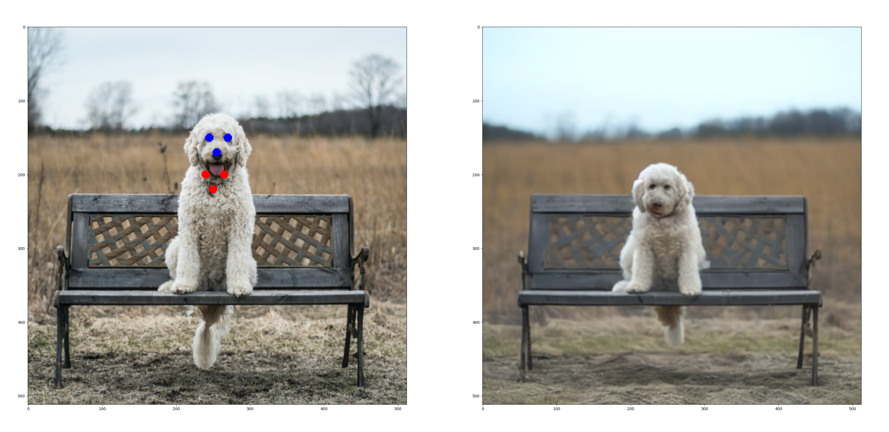

# DragDiffusion-diffusers


Unofficial implementation of [DragDiffusion: Harnessing Diffusion Models for Interactive Point-based Image Editing](https://arxiv.org/abs/2306.14435) based on [diffusers](https://github.com/huggingface/diffusers).


## Usage

According to the paper, the process of drag diffusion is split into 2 stages: 
1. LoRA training
2. Motion supervious + point tracking


You can run the following command to train the LoRA weights with the single demo image located at `asset/lora/train` folder.
```shell
accelerate launch --mixed_precision="fp16" train_lora.py \
  --pretrained_model_name_or_path="runwayml/stable-diffusion-v1-5" \
  --train_data_dir="asset/lora" --caption_column="text" \
  --resolution=512 --random_flip \
  --train_batch_size=1 \
  --num_train_epochs=200 --checkpointing_steps=50 \
  --learning_rate=1e-04 --lr_scheduler="constant" --lr_warmup_steps=0 \
  --seed=42 \
  --output_dir="sd-model-lora" \
  --validation_epochs=200 \
  --validation_prompt="A dog"
```

After you obtain the LoRA checkpoint, you can use it with *main.py drag_diffusion* to apply the drag diffusion with default parameter.

```shell
python3 main.py drag_diffusion --lora_model_path "./sd-model-lora"
```

This is the result you should get with default parameters:

